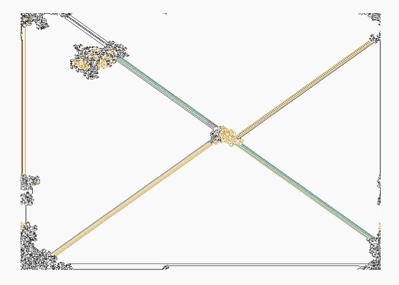
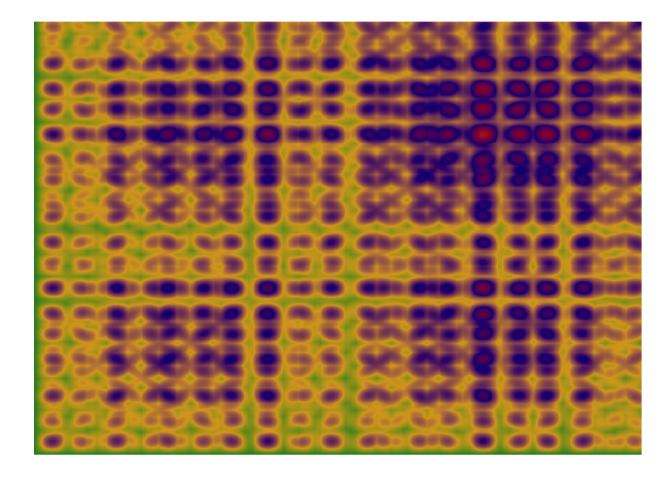
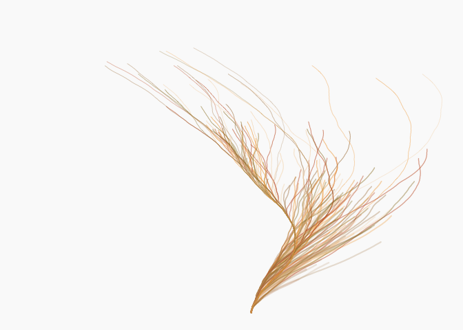
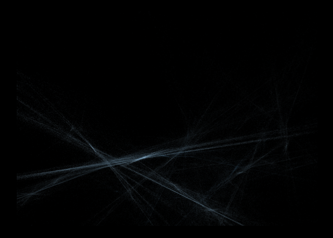
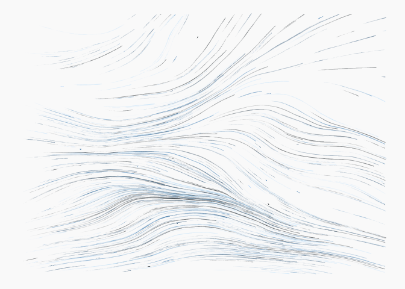

In this portfolio, I leanred another new package {aRtsy}, which can
generate art in R

``` r
#install.packages("aRtsy")
library(aRtsy)
#packageVersion("aRtsy")
```

``` r
#generate art 
artwork <- canvas_strokes(colors = c("black", "white"))
saveCanvas(artwork, filename = "myArtwork.png")
```

``` r
set.seed(2)
canvas_ant(colors = colorPalette("house"))
```



``` r
set.seed(1)
canvas_chladni(colors = colorPalette("tuscany1"))
```



``` r
set.seed(1)
canvas_cobweb(colors = colorPalette("tuscany1"))
```


``` r
set.seed(1)
canvas_collatz(colors = colorPalette("tuscany3"))
```



``` r
set.seed(2)
canvas_flame(colors = colorPalette("dark2"))
```



``` r
set.seed(1)
canvas_flow(colors = colorPalette("dark2"))
```



``` r
set.seed(1)
canvas_lissajous(colors = colorPalette("blossom"))
```


